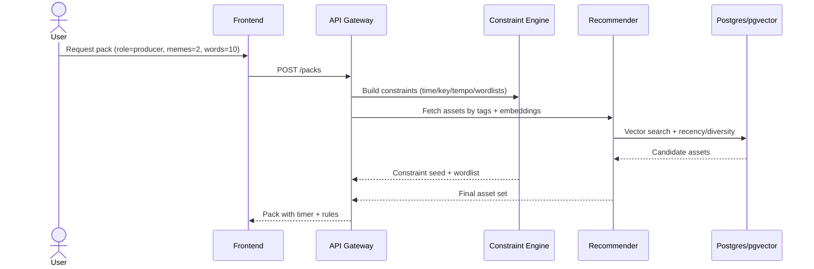
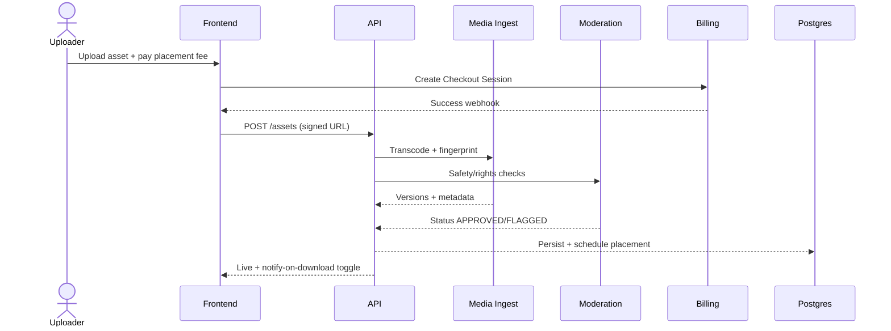

# Make Something — Architecture & Functional Spec

## 1. Why this Works (Evidence & Stats)
- Creator supply keeps expanding: Chartmetric counted **11.3M+ artists in 2024**, up **1.7M YoY (~4.6k/day)**. More creators equals a steady flow of customers seeking inspiration.
- Tooling spend is real: the **global DAW market was $3.2–4.1B in 2024** with ~**8.6–8.9% CAGR** projected through 2030–33 (Grand View Research; Fortune Business Insights).
- Rising music revenues create budget: IFPI reported **+4.8% global recorded-music revenue in 2024**, the tenth consecutive year of growth.
- Constraints unlock creativity: research shows deliberate limits and random prompts yield more novel ideas (SAGE Journals; ScienceDirect; The Big Bang Partnership).
- Improvisation science: fMRI studies on freestyle rap show unique neural patterns for structured improvisation (PubMed).
- Memes are part of the modern creative toolkit but carry licensing risk—design for permissioned assets (SSRN).

## 2. Product Summary
- **Make Something** delivers time-boxed, constraint-driven **"Fuel Packs"** mixing memes, words, micro-clips, keys/tempos, and themes tailored to role (rapper/singer/producer) and mood.
- **Monetisation**
  - Uploaders pay to place their content and receive download notifications.
  - Ads appear on download pages for non-subscribers.
  - Ultra-low subscription (recommend £0.99/year) removes ads and unlocks pro controls.

## 3. Core User Stories
- *Rapper*: receive 10 words + 2 memes + 1 beat topic, use 5 words within 8-bar timer.
- *Singer*: get emotional arc + key/tempo + 3 story beats, craft 16-bar melody/lyrics.
- *Producer*: Single-Source Challenge — sample only the provided meme/clip with helper tools (chop grid, pitch sets, BPM lock).

## 4. System Architecture (High Level)
```mermaid
flowchart LR
  U[Web/Mobile Client] -- HTTPS/JSON --> API[NestJS/Node API Gateway]
  U -- WebSockets --> RT[Realtime/WS]
  API --> AUTH[AuthN/Z]
  API --> SVC_REC[Recommendation & Pack Orchestrator]
  API --> SVC_GEN[Prompt/Randomizer & Constraint Engine]
  API --> SVC_MEDIA[Media Ingest & Transcode]
  API --> SVC_MOD[Moderation & Safety]
  API --> SVC_BILL[Billing & Entitlements]
  API --> SVC_ADS[Ad Broker]
  API --> DB[(Postgres + pgvector)]
  API --> CACHE[(Redis)]
  API --> MQ[(RabbitMQ/Kafka)]
  SVC_MEDIA --> OBJ[(Object Storage e.g., S3)]
  SVC_REC --> VEC[(Embeddings Index pgvector)]
  SVC_MOD --> CLS[ML filters (NSFW/toxicity)]
  SVC_MEDIA --> FP[Fingerprinting (Chromaprint/AcoustID)]
```

- **Frontend**: Next.js web; React Native/Expo mobile.
- **Backend**: NestJS (Node/TypeScript).
- **Data**: Postgres + pgvector; Redis cache.
- **Rec/Search**: SBERT embeddings; hybrid content-based & bandit exploration.
- **Media Pipeline**: FFMPEG, Chromaprint/AcoustID.
- **Messaging**: RabbitMQ or Kafka for ingest/moderation pipelines.
- **Storage**: S3 with signed URLs.
- **Auth**: OAuth (Apple/Google) + e-mail magic link.
- **Payments**: Stripe (placements + subs).
- **Ads**: Server-side (e.g., Google Ad Manager) only at download time.
- **Observability**: OpenTelemetry, Prometheus/Grafana, Sentry.

## 5. Data Model (Essentials)
```mermaid
erDiagram
  USER ||--o{ SESSION : has
  USER ||--o{ DOWNLOAD : makes
  USER ||--o{ PACK : requests
  USER ||--o{ UPLOAD : submits
  PACK ||--o{ PACK_ITEM : contains
  ASSET ||--o{ PACK_ITEM : referenced-in
  ASSET ||--o{ DOWNLOAD : target
  ASSET ||--o{ FINGERPRINT : has
  ASSET ||--o{ MODERATION : has
  TAG ||--o{ ASSET_TAG : labels
  ASSET ||--o{ ASSET_TAG : labelled-by
  BILLING ||--|| USER : for
  NOTIFY ||--|| UPLOAD : to

  USER{uuid id, text role, jsonb prefs, bool is_subscriber}
  PACK{uuid id, text mode, jsonb constraints, int seed, ts created_at}
  PACK_ITEM{uuid id, uuid pack_id, uuid asset_id, jsonb meta}
  ASSET{uuid id, text kind, text url, jsonb meta, text license, ts created_at}
  FINGERPRINT{uuid id, uuid asset_id, text fp_type, text hash}
  MODERATION{uuid id, uuid asset_id, text status, jsonb reasons}
  DOWNLOAD{uuid id, uuid user_id, uuid asset_id, ts ts}
  BILLING{uuid user_id, text plan, ts renews_at}
  NOTIFY{uuid id, uuid upload_id, uuid downloader_id, ts ts}
```

## 6. Key Flows
### A) Generate Fuel Pack


### B) Upload and Monetise


## 7. Recommendation & Constraint Logic
- **Constraint Engine**: role presets (rapper/singer/producer), knobs for word count, topics, keys/tempo, sample sources, timers.
  - Single-Source Challenge enforces sampling from only the provided asset; UI helpers (auto-slice, pitch sets) guide compliance.
- **Recommender**: content-based from embeddings + tags, plus contextual multi-armed bandit (Thompson sampling) to explore. Diversity caps prevent repeat uploaders dominating, ensure at least one wildcard per pack. Cold-start bootstrap via popularity and role-specific seeds. Store seeds for reproducibility.

## 8. Moderation, Rights & Safety
- Chromaprint/AcoustID fingerprinting checks duplicates/infringements.
- Uploaders warranty licensing; UI surfaces license terms.
- Automated classifiers for NSFW/toxicity; meme OCR for slurs; flagged content enters manual review.
- Copyright caution: emphasise uploader-owned/licensed memes. Clear takedowns/appeals.
- Privacy: downloader notifications require opt-in; default to aggregate stats.
- Security: OAuth, signed URLs, least privilege, rate limiting, audit logs, HSTS, CSP, WAF.

## 9. Functional Specification
### Roles
- Anonymous: browse samples, limited pack generation.
- Creator (free): unlimited pack generation, ad-supported downloads, basic saves.
- Subscriber: ad-free, advanced controls, offline packs, custom timers.
- Uploader: pay placements, dashboards (impressions/CTR/downloads), opt-in notifications.

### Major Features
- Pack Builder with role presets and sliders (words/memes/clips, moods, keys/tempo).
- Prompt surfaces tuned per role (rappers: rhyme families, banned word switch; singers: mood curves, melodic contour hints; producers: Single-Source toolkit).
- Timer & compliance tracker showing countdown and checklist (e.g., "used 5/10 words").
- Download gate with ads (unless subscriber).
- Uploader console with placement workflow, licensing affirmation, category tagging, notifications.
- Analytics: pack completion rates, time-to-first-idea, saves/shares, downloads, uploader ROI.
- Safety: report content, blocklist, moderation review queue.

### Representative API Endpoints
- `POST /auth/magic-link`
- `POST /packs`
- `GET /packs/{id}`
- `POST /assets/upload-url`
- `POST /assets/ingest`
- `POST /billing/checkout`
- `GET /uploader/insights`
- `POST /notify/subscribe`

## 10. Non-Functional Requirements
- Latency P95 <150ms for pack creation (excluding heavy media fetches).
- Availability 99.9% for API; async jobs with backoff retries.
- Scalability via stateless services + autoscaling; queues for ingest/moderation.
- Observability: tracing, dashboards, anomaly alerts.
- Data protection: GDPR-aligned, DPIA for notifications, data minimisation.

## 11. Monetisation Mechanics
- Placement tiers by category (producer samples vs lyric prompts vs mood boards) with pacing caps.
- Ads only on download pages; server-side rendering to reduce ad-block impact.
- Subscription pricing: keep ultra-low "vibe" via annual plan (~£0.99–1.49) to cover payment processing.

## 12. Success Metrics
- Activation: % new users finishing a pack in 24h (45% MVP → 60% V1).
- Time-to-first-idea: median seconds to first save (<90s target).
- Constraint compliance: % packs where users meet rules (>50%).
- Uploader ROI: downloads per £, repeat placements (>30% MoM).
- Ad yield: RPM on download pages, sub conversion of heavy users.
- Safety: flagged content rate (<0.5% after moderation).

## 13. MoSCoW Prioritisation
- **Must**: role-based builder, constraint engine, hybrid recs with seed reproducibility, ingest/transcode/fingerprint/moderate pipeline, ad-supported downloads + subscriber bypass, basic analytics.
- **Should**: Single-Source tools, downloader opt-in notifications, embedding "surprise me", compliance tracker, bandit A/B.
- **Could**: offline packs, collab mode, mood curve editor, creativity break nudges.
- **Won’t (for now)**: full in-browser DAW, auto-clearance of third-party memes.

## 14. Phased Delivery
- **Phase 0 (2–3 wks)**: basic pack builder, static wordlists, manual moderation, Stripe placements, track activation/completion.
- **Phase 1 (6–8 wks)**: embeddings + pgvector, diversity logic, Chromaprint + NSFW/toxicity filters, ad integration, uploader console.
- **Phase 2 (8–12 wks)**: Single-Source UI, bandit experimentation, compliance tracker, share/save, downloader notifications.
- **Phase 3+**: Mobile app with offline packs, collab mode, advanced analytics/discovery.

## 15. Security & Privacy Highlights
- Rotating signing keys, short-lived JWTs, device binding, magic-link replay protection.
- Signed URLs (<5 min read, <2 min write), separate buckets for raw vs approved media.
- PII minimisation: aggregated stats by default, per-download identity requires consent.
- Abuse resistance: rate limits, quotas, anomaly detection, content policy + audits.

## 16. UX Principles for Flow
- Minimal knobs: one primary slider per role.
- Timer defaults (e.g., 8-minute sprint) with visible checkboxes for constraints.
- Include a “weird wildcard” in every pack to spur novelty.
- Finish with action choices: save/share/"one more spin" to celebrate micro-wins.

## 17. Risks & Mitigations
- **Copyright (memes)**: start with licensed/uploader-owned assets, fingerprint checks, clear takedowns/appeals.
- **Economics of micro-sub**: push annual plan, bundle perks (offline packs, pro sliders).
- **Content safety**: layered moderation, user reports, probation for new uploaders.

## 18. Team & Effort Snapshot
- Backend: 1–2 engineers (API, ingest, recs, billing, ads).
- Frontend: 1–2 engineers (Next.js MVP → React Native later).
- ML/Recs: 0.5–1 engineer (embeddings, bandits, moderation tuning).
- Design: 0.5 FTE (constraint-first UI, motion, accessibility).
- Ops: 0.25 FTE (infra, observability, CI/CD).

## 19. Killer Demo Script (First User Test)
1. Choose Rapper role → set 12 words, 1 meme, 2-minute timer.
2. Hit "Spin" → pack appears; timer starts; words tick off as used.
3. Save pack; watch ad to download meme; end screen prompts "Run it back?".
4. Switch to Producer role → Single-Source Challenge; upload 10-sec clip; auto-slices + BPM lock appear; export chops.

## 20. Glossary
- **Fuel Pack**: constraint-driven bundle of prompts/media.
- **Single-Source Challenge**: composition limited to one provided asset.
- **Placement**: paid inclusion of uploader content in packs.
- **Compliance Tracker**: checklist confirming constraints were met.
